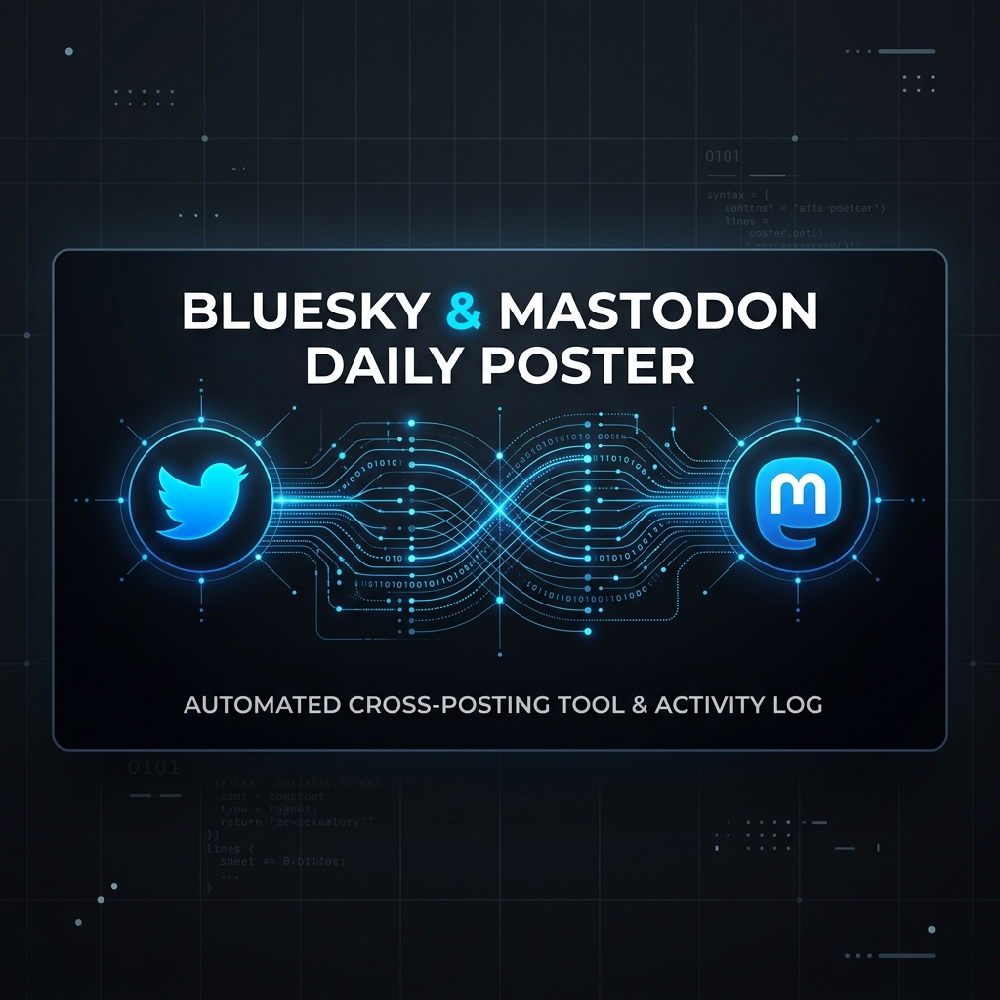

# Bluesky & Mastodon Daily Poster (v4.4.0) 🚀



An autonomous, multi-channel technical broadcasting engine for **Bluesky** and **Mastodon**. This project is part of the **askfred** technical suite, focused on delivering high-signal academic and professional insights to the decentralized web.

## 📡 Live Status
| Component | Status | Last Run | Mode |
| :--- | :--- | :--- | :--- |
| **Broadcaster** | Operational | 2026-04-13 | 💡 Mentor |
| **Signal Strength** | Elite (Async) | -- | -- |

---

## 🚀 Key Features

### 🎓 The Scholar Engine
*   **Academic Priority**: Automatically prioritizes research from **arXiv** (`cs.AI`, `cs.LG`, `cs.RO`) using a weighted ranking algorithm.
*   **Scholar Highlight**: Specialized synthesis logic that translates complex research into pragmatics for IT leadership and business strategy.

### 🛡️ Security & Resilience (The Fortress)
*   **Interaction Circuit Breakers**: Caps on replies per session to prevent mention-spam and API credit exhaustion.
*   **Anti-Spam Sanitization**: Automatic redaction of injection-style keywords from incoming user mentions.
*   **API Backoff & Jitter**: Exponential backoff with randomized jitter ensures the bot survives platform instability without risking rate-limit bans.

### 📡 Multi-Channel Broadcasting
*   **Asynchronous Parallel Delivery**: Concurrent posting to Bluesky and Mastodon for maximum performance and reduced latency.
*   **Smart Threading**: AI-driven logic that automatically generates a linked **3–5 post thread** with human-like inter-post timing.

### 🤖 Dual-Persona Intelligence
*   **Morning Run (08:00 UTC / 10:00 local)**: **The Curator** — High-signal tech and research synthesis.
*   **Afternoon Run (14:30 UTC / 16:30 local)**: **The Mentor** — Professional wisdom, career advice, and work-life balance tips.

---

## 🛠️ Setup & Configuration

### Environment Variables
Add the following to your GitHub repo secrets (`Settings > Secrets and variables > Actions`):

| Secret | Required | Description |
| :--- | :--- | :--- |
| `GEMINI_API_KEY` | ✅ Yes | Google AI Studio key for content generation. |
| `BLUESKY_USERNAME` | ✅ Yes | Your Bluesky handle (e.g., `askfred.be`). |
| `BLUESKY_APP_PASSWORD` | ✅ Yes | App-specific password from Bluesky settings. |
| `MASTODON_ACCESS_TOKEN` | Optional | Access token from your Mastodon instance. |
| `MASTODON_API_BASE_URL` | Optional | Your Mastodon instance URL (e.g., `https://mastodon.social`). |
| `OPENAI_API_KEY` | Optional | Used for DALL-E 3 visual asset generation. |

### Installation & Local Run
```bash
pip install -r requirements.txt
python main.py
```

### Running Tests
```bash
pytest
```

---

## 📂 Project Structure

```
.
├── main.py                    # Async orchestrator & entry point
├── src/
│   ├── agents.py              # AI content generation & interaction handling
│   ├── broadcasters.py        # Bluesky & Mastodon platform broadcasters
│   ├── config.py              # All constants, personas, and RSS feeds
│   ├── logger.py              # Sanitized SafeLogger (security layer)
│   └── utils.py               # Async RSS fetching, retry logic, image utils
├── tests/
│   ├── conftest.py            # Pytest async configuration
│   ├── test_ranking.py        # Unit tests for Scholar Gem ranking & deduplication
│   └── test_protection.py     # Unit tests for security & resilience logic
├── .github/
│   ├── workflows/daily_post.yml  # GitHub Actions schedule (08:00 & 14:30 UTC)
│   └── dependabot.yml            # Automated dependency vulnerability scanning
├── pytest.ini                 # Pytest asyncio mode configuration
├── requirements.txt
└── README.md
```

---

## ⚖️ License
MIT License. Built with ❤️ by **askfred**.
